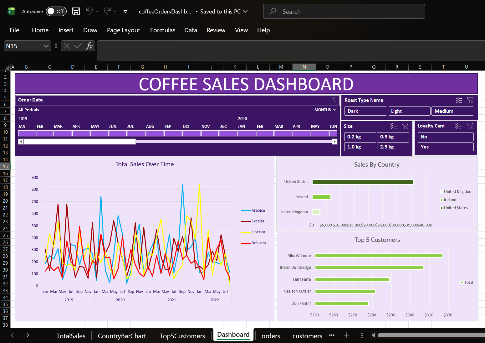

# Coffee-Shop-Sales-Analysis
Data analysis and interactive dashboard for a retail coffee shop using Excel (XLOOKUP, Pivot Tables, and Dashboards)

## 📊 Project Overview
This project provides a deep dive into the sales performance of a coffee retail business across the United States, Ireland, and the United Kingdom. Using Excel, I transformed raw transactional data into an interactive dashboard to track revenue trends and customer behavior.

## 🎯 Business Objectives
* Analyze total sales trends over a 4-year period.
* Compare performance across different coffee types (Arabica, Robusta, Liberica, Excelsa).
* Identify top-performing countries and customers.
* Evaluate the impact of the Customer Loyalty Program on total revenue.
* Provide a breakdown of sales by roast type and package size.

## 🛠️ Tech Stack & Skills
* **Tool:** Microsoft Excel (Advanced)
* **Data Modeling:** Utilized **XLOOKUP** and **INDEX/MATCH** to connect Orders, Customers, and Products tables.
* **Data Engineering:** Cleaned inconsistent data formats, handled missing values, and standardized date formats.
* **Analysis:** Used Pivot Tables to aggregate sales by date, country, and product.
* **Visualization:** Created a dynamic dashboard using **Timeline Slicers**, custom-styled Bar Charts, and interactive filters.

## 🖼️ Dashboard Preview

## 📈 Key Insights
* **Top Market:** The United States is the largest market, contributing significantly more revenue than Ireland and the UK.
* **Product Preference:** Arabica and Excelsa are the most popular coffee types, showing consistent demand.
* **Customer Loyalty:** A substantial portion of sales comes from Loyalty Card members, proving the program's effectiveness.
* **Growth Trend:** Sales showed distinct seasonal patterns, with specific peaks in 2021.

## 💡 Final Recommendation
The business should focus on expanding the Loyalty Program in the UK and Ireland markets to match the retention levels seen in the US. Additionally, marketing efforts should highlight "Light Roast" Arabica products, as they show the highest profit margins.
